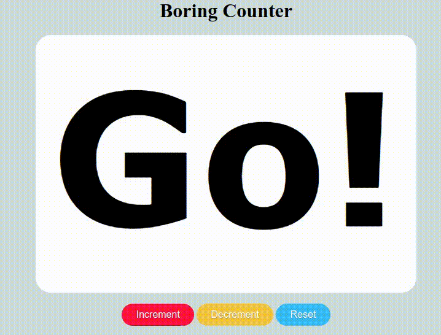

# Go-Wasm
We assume that you have had a skimming📑 on **What, Why, and How Web Assembly?** Well, if you haven't already, take a look at this awesome [article](https://developer.mozilla.org/en-US/docs/WebAssembly) and come back here. \
This task is all about completing the Go script given to you and deploying the model on the web. To ease things for you, we have broken down the task into 4 simple steps:  
1. Implement the functions in [main.go](main.go) file.
2. Make the buttons in [index.html](index.html) functional. 
3. Compile the [main.go](main.go) to wasm.
4. Deploy the model on the web.

## 🏃 Getting Started
First things first, Setting up the environment for the task:
- [Install](https://go.dev/doc/install) Go 1.11 or newer version. For troubleshooting, see the [Install Troubleshooting](https://github.com/golang/go/wiki/InstallTroubleshooting) page.  
PS: Go 1.18.5 is used while preparing this task.
- Go ahead and clone this repo.
```
git clone https://github.com/amfoss/tasks.git
```
- Navigate to task-07 and follow the steps mentioned above.

## 📚 Resources
[Getting Started with Go and Wasm](https://github.com/golang/go/wiki/WebAssembly#getting-started)  
[Getting started with Go](https://go.dev/doc/tutorial/getting-started)  
[Interacting with the DOM](https://pkg.go.dev/syscall/js)
## 🙌 Wrap-up
It's time for your action now 😄. Complete the task according to the steps mentioned above.  

The final output should be something like this 👇

  

Have Fun and Good Luck 👍


