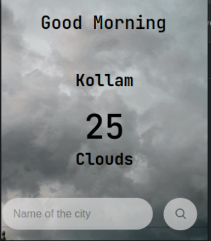
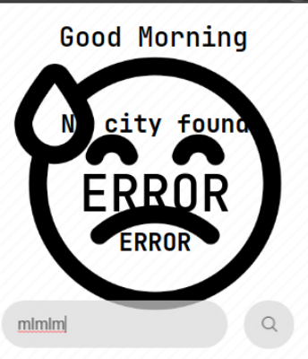

# AK-47°C 

Comrade Kalashnikov got drenched on his visit to the motherland. He was punished by his superiors for not being properly dressed.
 
Create a handy chrome extension for Kalashnikov which will keep him well informed about the weather at his next rendezvous location so that he can prepare and dress accordingly to not get reprimanded by his superiors again.
.

Use HTML, CSS, and JavaScript to complete the task. The extension should return real-time weather data of any location according to user input.

## Additional Guidelines
* You are free to spice up the task with images and extra styling.
* The manifest version should be v3. Any other version will **NOT BE EVALUATED**.

* While deploying your extension on the Chrome store would benefit a lot of people, that is beyond the scope of this task and is **completely optional**.

Want a working example? Check out this extension made by the club:

[amFOSS WeatherCaster](https://chrome.google.com/webstore/detail/amfoss-weathercaster/kddidipdkgeefchigfgbjmonjpaknjfc/related)

 

Happy Hacking!

